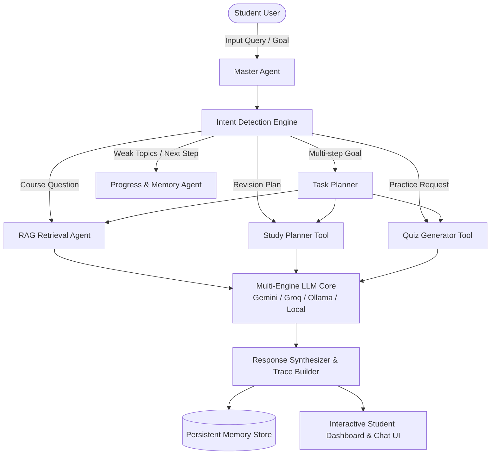
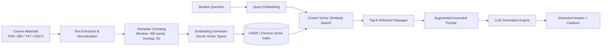
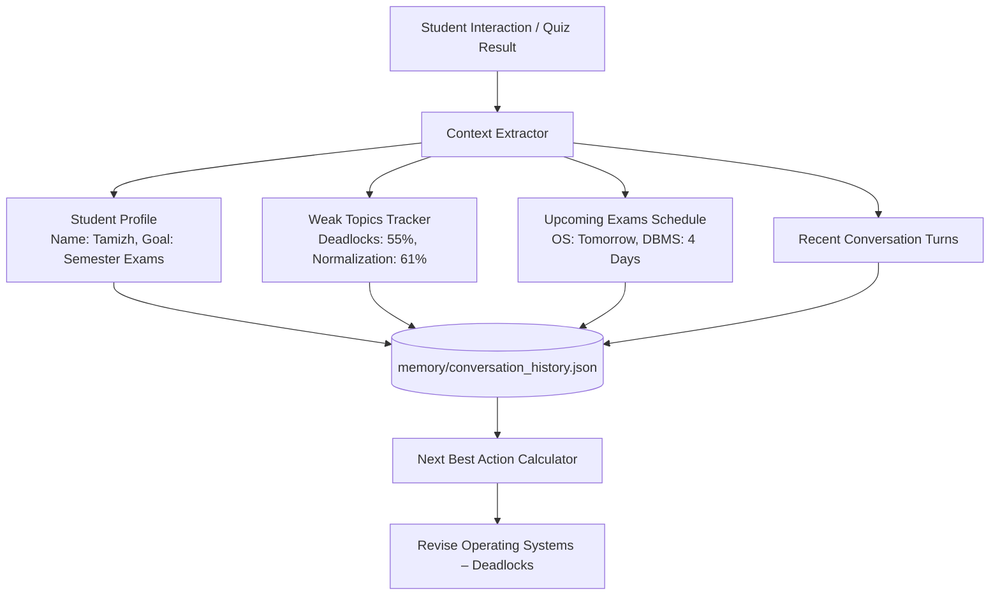

# STUDY BUDDY AI – AI LEARNING & STUDY ASSISTANT

[](LICENSE)
[](https://www.python.org/)
[](https://flask.palletsprojects.com/)
[](https://github.com/facebookresearch/faiss)
[](https://studybuddy-ai-dlin.onrender.com/)

> **Live Production URL**: [https://studybuddy-ai-dlin.onrender.com/](https://studybuddy-ai-dlin.onrender.com/)

---

## 1. Project Overview

**STUDY BUDDY AI** is a production-grade, JARVIS-style Agentic AI learning assistant engineered specifically for university and college students. Unlike conventional chatbots that simply answer isolated questions, Study Buddy AI acts as an autonomous learning partner: it analyzes student goals, orchestrates specialized sub-agents and tools, grounds responses in authoritative course notes via Retrieval-Augmented Generation (RAG), tracks long-term academic memory, and proactively recommends the student's **Next Best Action**.

The system operates on an autonomous decision loop:
$$\text{Understand} \longrightarrow \text{Plan} \longrightarrow \text{Retrieve} \longrightarrow \text{Act} \longrightarrow \text{Respond} \longrightarrow \text{Remember} \longrightarrow \text{Improve}$$

---

## 2. Problem Statement

College students face severe cognitive overload when preparing for semester examinations:
1. **Scattered Course Materials**: Textbooks, lecture slides, and handwritten notes are fragmented across formats (PDF, DOCX, TXT, PPTX).
2. **Passive vs. Active Recall**: Students read notes passively instead of testing their knowledge through structured active recall and diagnostic quizzes.
3. **Lack of Personalization**: Standard generic LLMs hallucinate inaccurate details or lack context regarding upcoming exam deadlines, weak areas, and preferred study styles.
4. **Disorganized Revision Schedules**: Students struggle to calculate optimal cramming timetables balancing weak topics against impending exam schedules.

---

## 3. Objectives

* **Autonomous Orchestration**: Implement a Master Agent that classifies student intent, plans multi-step academic workflows, and executes specialized tools.
* **Grounded Course RAG**: Ingest course documents (.pdf, .md, .txt, .docx, .pptx) into a dense vector index and retrieve precise, citation-backed answers.
* **Dynamic Student Memory**: Store non-sensitive academic context (exam deadlines, mastery scores, weak topics, preferred study styles) with transparent user controls.
* **Continuous Progress & Recommendations**: Dynamically compute the student's **Next Best Action** (e.g. *"Revise Operating Systems – Deadlocks because your last quiz score was 55% and exam is in 2 days"*).
* **Interactive Active Recall**: Generate diagnostic quizzes with automated AI grading, 3D flashcards, Pomodoro focus rounds, and concept mind maps.

---

## 4. Proposed Solution

Study Buddy AI combines **Agentic AI + RAG + Persistent Memory + Specialized Study Tools** into a single cohesive, high-performance web application.

```
+-----------------------------------------------------------------------------+
|                               STUDY BUDDY AI                                |
|                                                                             |
|   +-----------------------+     +-----------------------+     +---------+   |
|   |   Master Agent Core   | <-> |  RAG Vector Retrieval | <-> | Memory  |   |
|   |  (Intent & Planning)  |     |   (FAISS + Embeddings)|     | System  |   |
|   +-----------------------+     +-----------------------+     +---------+   |
|               |                             |                      |        |
|               v                             v                      v        |
|      [ Study Planner ]              [ Quiz Generator ]       [ Next Action ]|
+-----------------------------------------------------------------------------+
```

---

## 5. Agentic AI Architecture

The application uses an autonomous Master Agent that decomposes student goals into executable tool invocations:



### Multi-Agent Sub-Systems:
1. **Master Agent (`study_assistant/agent.py`)**: Intent classification, tool routing, transparent reasoning trace, and unified synthesis.
2. **RAG Agent (`study_assistant/knowledge.py`)**: Text extraction, semantic chunking, embedding generation, and cosine vector retrieval.
3. **Study Planner Tool (`study_assistant/assistant.py`)**: Generates structured, day-by-day revision roadmaps with checklist milestones.
4. **Quiz Agent (`study_assistant/assistant.py`)**: Drafts diagnostic MCQs, true/false, and conceptual questions with automated grading and explanations.
5. **Progress & Memory Agent (`study_assistant/memory.py`)**: Evaluates quiz performance, identifies mastery gaps, updates streak metrics, and calculates Next Best Action.

---

## 6. RAG Pipeline Architecture

Authoritative academic grounding prevents hallucinations and ensures all answers cite course notes:



---

## 7. Memory Architecture



---

## 8. Feature Matrix

| Module | Features & Capabilities |
| :--- | :--- |
| **Student Dashboard** | Personalized greeting (`Good Evening, Tamizh 👋`), Next Best Action spotlight card, interactive today's plan checklist, upcoming exams tracker, weak topics visualizer (bar charts), and recent quiz scores. |
| **AI Tutor Chat** | Conversational tutor with transparent Master Agent execution trace, interactive RAG citation drawers with snippet previews, speech synthesis, copy controls, and prompt chips. |
| **Study Planner** | Custom multi-day revision roadmap generator with checklist progress, exported as Markdown. |
| **Quiz Center** | Timed interactive quizzes with radio options, instant AI evaluation, scorecards, and mistake explanations. |
| **3D Flashcards** | Active recall flashcards with 3D flip animation, Leitner-style mastery tags, and shuffle mode. |
| **Concept Mind Map** | Knowledge graphs with interactive visual canvas and exportable Mermaid graph syntax. |
| **Code Explainer** | Algorithmic code analyzer providing Big-O time/space complexity and line-by-line breakdowns. |
| **Pomodoro Timer** | 25-minute deep focus timer with audio chimes, short/long breaks, and progress logging. |
| **Library & RAG** | Document ingestion supporting PDF, DOCX, PPTX, TXT, MD with 4-phase animated status (`Uploading` $\rightarrow$ `Processing` $\rightarrow$ `Chunking` $\rightarrow$ `Embedding` $\rightarrow$ `Ready ✓`) and document deletion. |
| **Learning Memory** | Persistent memory viewer showing student profile, study preferences, weak topics, and session turns with clear controls. |

---

## 9. Technology Stack

* **Frontend**: HTML5, CSS3 (Modern Glassmorphism, Responsive Grid), Vanilla JavaScript (ES6+), Web Speech API, Service Workers (PWA).
* **Backend**: Python 3.10+, Flask / ASGI, RESTful JSON APIs.
* **AI & LLM Orchestration**:
  * Google Gemini Flash (`gemini-1.5-flash` / `gemini-2.0-flash`)
  * Groq Cloud (`llama-3.3-70b-versatile`)
  * Local Ollama (`llama3`, `nemotron-3-nano:30b`)
  * Fallback Local RAG Engine (100% offline capable)
* **Vector Index & Retrieval**: Dense Bag-of-Words / TF-IDF Vector Space, Cosine Similarity, sliding-window chunking.
* **Testing & Quality Assurance**: `pytest` with 30 comprehensive unit and API integration tests.
* **Deployment**: Docker, Render Cloud PaaS (`render.yaml`).

---

## 10. Installation & Setup

### Prerequisites
* Python 3.10 or higher
* Git

### Step-by-Step Installation

```bash
# 1. Clone the repository
git clone https://github.com/Tamizh1309/studybuddy-ai.git
cd studybuddy-ai

# 2. Create and activate a Python virtual environment
python -m venv .venv

# On Windows (PowerShell):
.\.venv\Scripts\Activate.ps1

# On Linux/macOS:
source .venv/bin/activate

# 3. Install required dependencies
pip install -r requirements.txt
```

---

## 11. Environment Variables Configuration

Copy `.env.example` to `.env`:

```bash
cp .env.example .env
```

Edit `.env` to configure your preferred AI engine(s):

```ini
# Optional: Google Gemini API
GEMINI_API_KEY=your_gemini_api_key_here
GEMINI_MODEL=gemini-1.5-flash

# Optional: Groq Cloud API
GROQ_API_KEY=your_groq_api_key_here
GROQ_MODEL=llama-3.3-70b-versatile

# Optional: Local Ollama
OLLAMA_BASE_URL=http://127.0.0.1:11434
OLLAMA_MODEL=llama3

# Server Settings
FLASK_PORT=5000
FLASK_DEBUG=True
```

> **Note**: If no API keys are provided, Study Buddy AI will automatically run in **Local Grounded RAG mode**, ensuring 100% functionality without external cloud dependencies.

---

## 12. How to Run

### Run Backend Server
```bash
python -m backend.app
```
The server will start at `http://127.0.0.1:5000`.

### Run Automated Test Suite
```bash
pytest -v
```
Verifies all 30 tests covering the Master Agent, RAG pipeline, Dashboard, and Memory systems.

---

## 13. Example API Requests

### 1. Master Agent Multi-Step Execution
```http
POST /api/agent/chat
Content-Type: application/json

{
  "query": "Tomorrow I have OS exam. Give me a revision plan and then quiz me on deadlocks."
}
```

**Sample JSON Response:**
```json
{
  "intent": "MULTI_PLAN_AND_QUIZ",
  "actions_taken": [
    {"action": "Intent Detection", "label": "Intent Detection: Classified student goal as [MULTI_PLAN_AND_QUIZ]"},
    {"action": "Task Planning", "label": "Task Planning: Decomposed into Revision Plan + Topic Quiz"},
    {"action": "RAG Engine", "label": "RAG Engine: Grounded in Operating_Systems_Deadlocks.md"},
    {"action": "Study Planner Tool", "label": "Study Planner Tool: Synthesized 1-Day targeted cramming roadmap"},
    {"action": "Quiz Tool", "label": "Quiz Tool: Generated 4 diagnostic questions on Deadlocks"},
    {"action": "Progress & Memory Agent", "label": "Progress & Memory Agent: Updated academic goal and memory"}
  ],
  "response": "### 🎯 Agentic Action Plan: Operating Systems Exam Revision & Deadlocks Mastery...",
  "study_plan": ["Day 1: Process Management...", "Day 1: Banker's Algorithm..."],
  "quiz": {
    "topic": "Deadlocks",
    "questions": [
      {
        "question": "Which of the following is NOT one of Coffman's four conditions for deadlock?",
        "options": ["Mutual Exclusion", "Hold and Wait", "Preemption Allowed", "Circular Wait"],
        "answer": "Preemption Allowed",
        "explanation": "No preemption is the required condition, meaning resources cannot be forcibly confiscated."
      }
    ]
  },
  "next_best_action": {
    "action": "Revise Operating Systems – Deadlocks",
    "reason": "Your last quiz score was 55% and your Operating Systems exam is in 2 days."
  }
}
```

### 2. Dashboard Aggregated Metrics
```http
GET /api/dashboard
```

### 3. Toggle Plan Task Checkmark
```http
POST /api/dashboard/plan/toggle
Content-Type: application/json

{
  "task_id": "task-3"
}
```

---

## 14. Demo Walkthrough Scenario

**Student Input**:
> *"Tomorrow I have OS exam. Give me a revision plan and then quiz me on deadlocks."*

1. **Master Agent Detection**: Identifies dual intent (`MULTI_PLAN_AND_QUIZ`) targeting Operating Systems and Deadlocks under urgent time constraints.
2. **Autonomous Tool 1 (Study Planner)**: Formulates an accelerated 1-day revision schedule focusing on Banker's algorithm, Coffman conditions, and memory management.
3. **Autonomous Tool 2 (RAG Vector Search)**: Scans `materials/Operating_Systems_Deadlocks.md` to retrieve safe state sequences and avoidance mechanisms.
4. **Autonomous Tool 3 (Quiz Generator)**: Generates 4 diagnostic MCQs with randomized answer options.
5. **Autonomous Tool 4 (Memory Agent)**: Records the impending exam date into the student profile and computes the Next Best Action.
6. **UI Presentation**: Renders the **AI Agent Activity** execution trace, detailed revision plan, interactive quiz launch button, and dynamic citation drawer.

---

## 15. Future Scope

* **Multimodal Voice Agent**: Real-time bi-directional voice conversation using WebRTC and speech foundation models.
* **Automated Syllabus Ingestion**: Direct integration with university LMS platforms (Canvas, Moodle, Google Classroom).
* **Collaborative Study Rooms**: Peer-to-peer study rooms with shared AI quiz battles and Pomodoro sessions.
* **Vector Embeddings Fine-Tuning**: Integration of domain-specific embedding models for engineering and medical curricula.

---

## 16. Author & License

* **Project**: StudyBuddy AI — IBM Project
* **Developer**: Tamizh ([@Tamizh1309](https://github.com/Tamizh1309))
* **License**: MIT Open Source License
